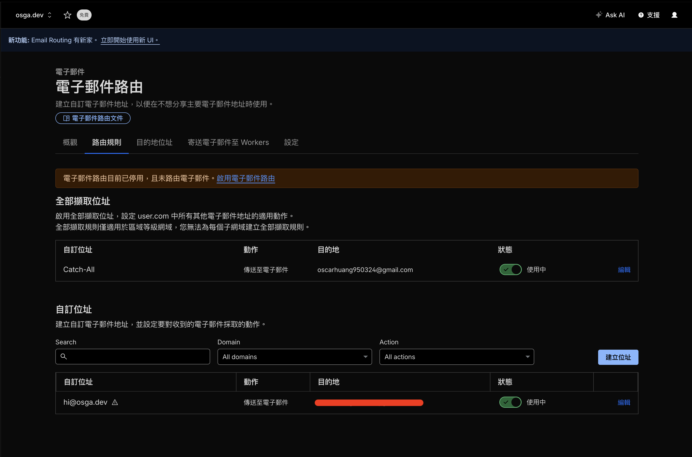
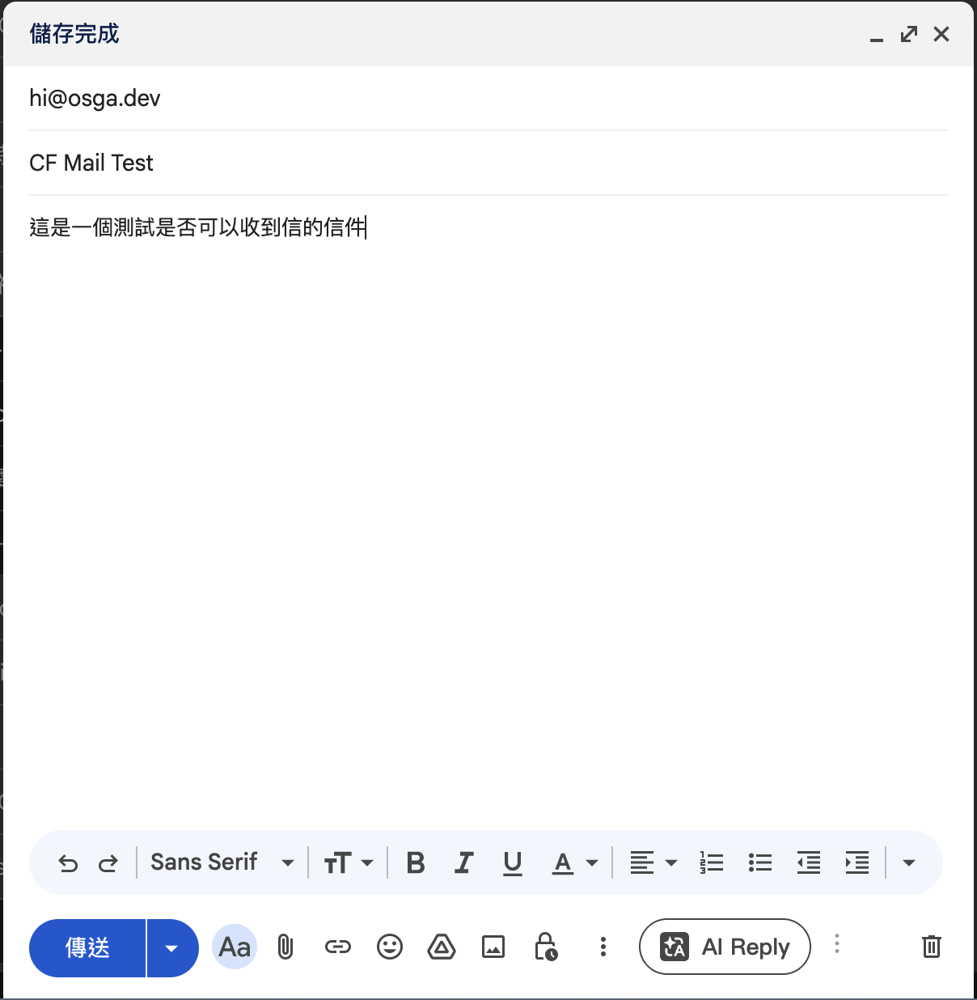
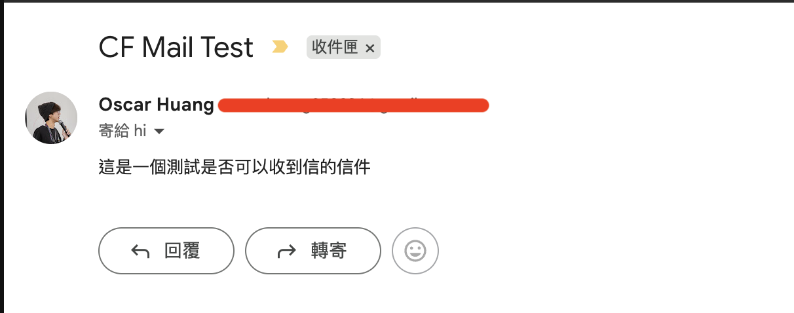
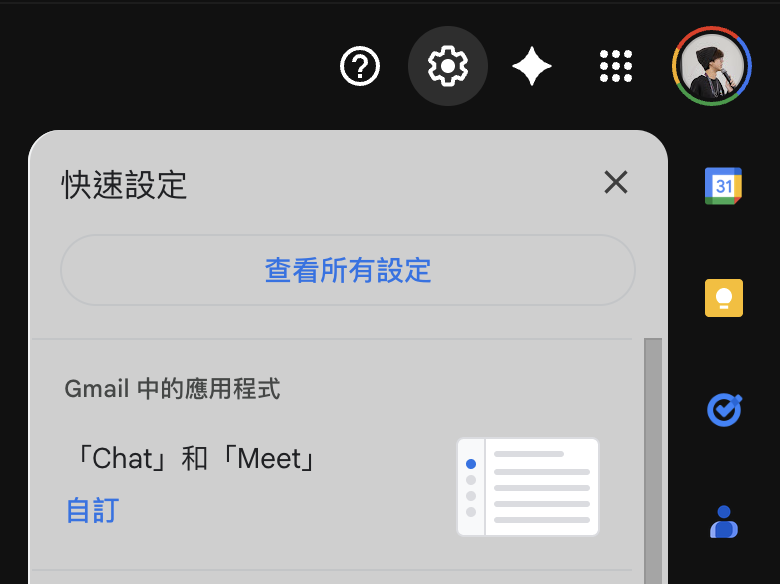
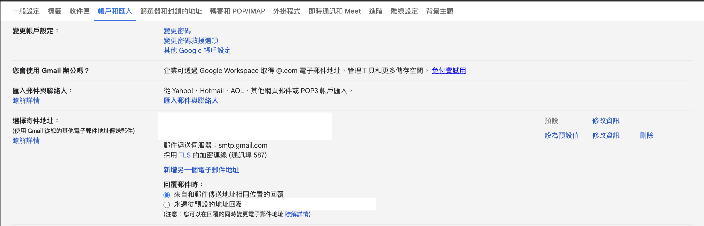
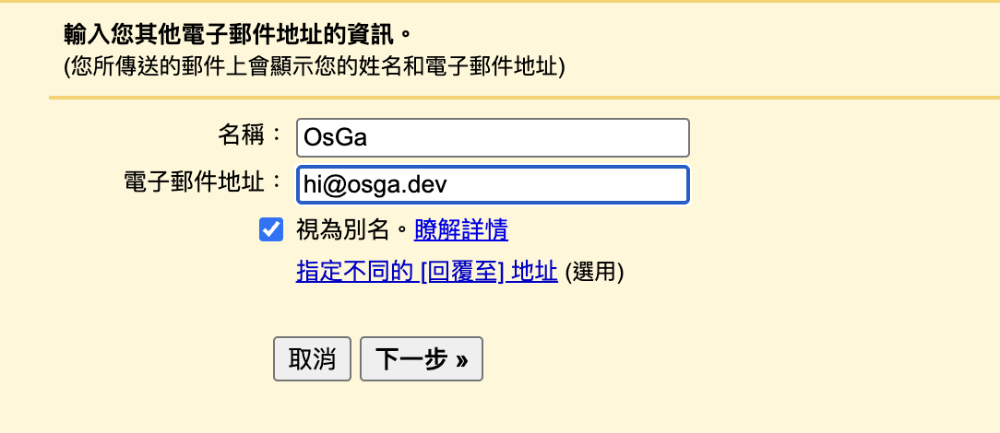
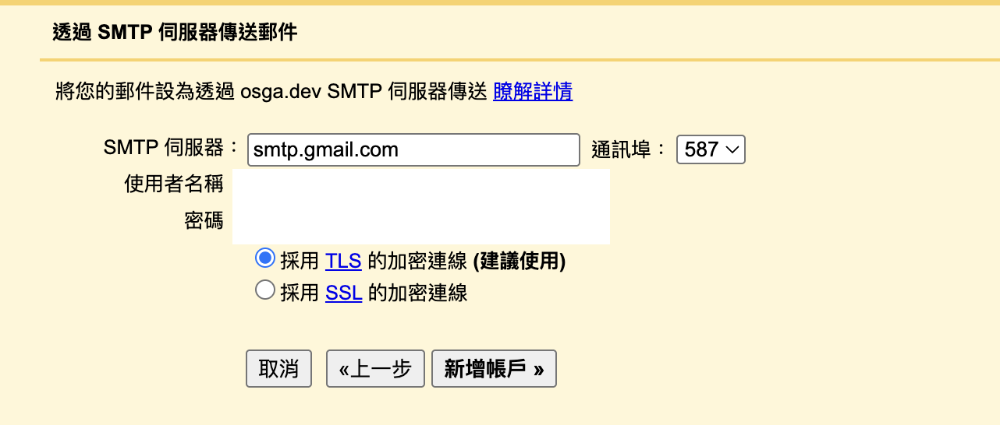
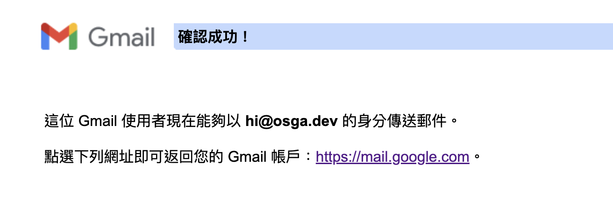
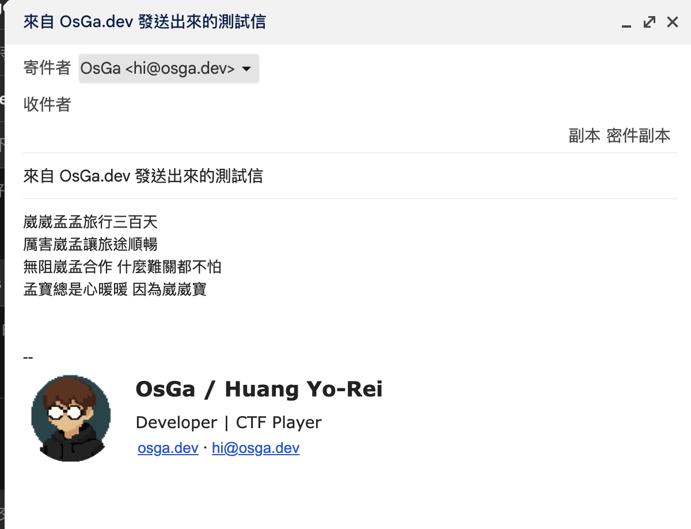
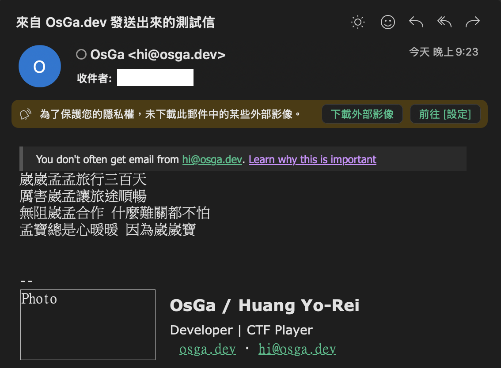

# 前言

當你買了一個自己覺得酷酷的 Domain，想用這個信箱來寄一些信給朋友、工作上聯絡等等...

結果發現 Google Workspace 真的好貴嗚嗚，而且自己的需求也沒那麼大，只是想簡單收發個信而已

所以，讓我們用 Cloudflare + Gmail 打出一套免費套餐！

# 收信

如果有在用 Cloudflare，應該都知道 Cloudflare 本身就有 forward 功能

舊版可以到 Domains → 你想要收信的 Domain panel 裡，找到電子信件路由 → 路由規則

新版則被搬到 運算 → 電子郵件服務 → 電子郵件路由

你可以在下方自訂位址，設定一個自己 domain 的收信信箱，然後 forward 到你平常在用的 Gmail、Outlook 之類的信箱

這樣只要有人寄信到你設定好的信箱，Cloudflare 就會自動幫你轉寄到你指定的目的地

當然你也可以設定 `*@example.com`，這樣任何開頭，例如 `hi@example.com`、`abcd@example.com` ... 都會轉寄到你設定的目的地  
好處是你可以用不同信箱名稱來區分用途，之後在收信端做分類也會比較方便

像是你可以這樣玩：

- `work@example.com` 拿來工作聯絡
- `hi@example.com` 拿來日常往來
- `shopping@example.com` 拿來註冊購物網站
- `game@example.com` 拿來註冊遊戲或論壇
- `trash@example.com` 拿來丟一些你不太信任、但又非註冊不可的服務

這樣之後如果哪個信箱開始狂收到廣告或垃圾信，你也比較容易知道是誰把你的信箱流出去的

# 寄信

不過這樣我們還是不能直接用自己的 Domain 來寄信，因為上面那套只是收信轉寄而已

如果你想自己架 SMTP Server，除了麻煩之外，還會遇到 IP 信任度、垃圾信判定、SPF / DKIM / DMARC 之類的問題，對只是想小量寄信的人來說真的有點太硬

但如果只是小量寄件，其實 Gmail 本身就有提供 SMTP 可以用，拿來當自己的發信出口就夠用了

到 Gmail 的所有設定

找到 `帳戶和匯入` 分頁，底下有個 `選擇寄件地址`，點 `新增另一個電子郵件地址`

名稱就是這個信箱寄信時要顯示的名字，電子郵件地址就是你要拿來寄出的那個信箱

SMTP 的設定如下：

- SMTP 伺服器：`smtp.gmail.com`
- 使用者名稱：你的 Gmail 信箱
- 密碼：你的 Gmail 密碼

> 如果你的帳號有開 2FA，可以到 [MyAccount](https://myaccount.google.com/apppasswords) 建立專屬密碼來用

設定完成後，Gmail 會寄一封確認信到你剛剛填的信箱  
因為我們前面已經用 Cloudflare 把信轉寄到你平常在收的信箱了，所以去收那封確認信，點裡面的驗證網址就完成了

重新整理一下 Gmail，就可以看到剛剛設定好的寄件地址

你也可以把它設成預設寄件信箱，或是幫不同信箱配不同簽名檔，讓不同用途的信件分得更清楚

## 補充一下 Gmail SMTP 的限制

這套很適合個人、小量、低頻率使用

如果你是用一般個人 Gmail 帳號，Google 官方的每日寄信上限是 **500 封**，而且 **單封信最多也不要超過 500 個收件人**

所以這套比較適合：

- 個人聯絡
- 小量工作往來
- 網站表單通知轉寄後手動回信
- 履歷、自介、接案聯絡
- 自己平常用自己的網域寄信

但如果你要拿來發電子報、大量通知、行銷信，就不太適合了，很容易撞到限制，寄送穩定性也不是設計給這種用途的

真的有大量發信需求的話，還是建議上專門的郵件服務，像是 Google Workspace、Resend、SendGrid、Mailgun 之類的會比較妥當

# 參考資訊

- [TonyPepe - 自訂網域免費收發信 -- Cloudflare Email Routing 搭配 Gmail SMTP](https://tonypepe.com/posts/others/cf-email-routing-gmail)
- [ianiiaannn's Blog - 使用 Gmail SMTP 免費以自訂網域收發 Email](https://iancmd.dev/posts/computer-science/google-domains-free-email/)
