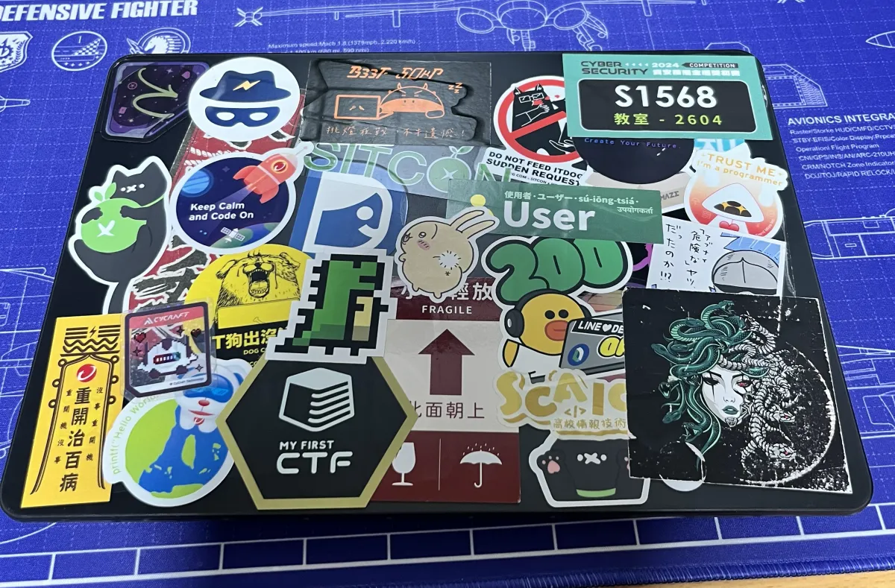
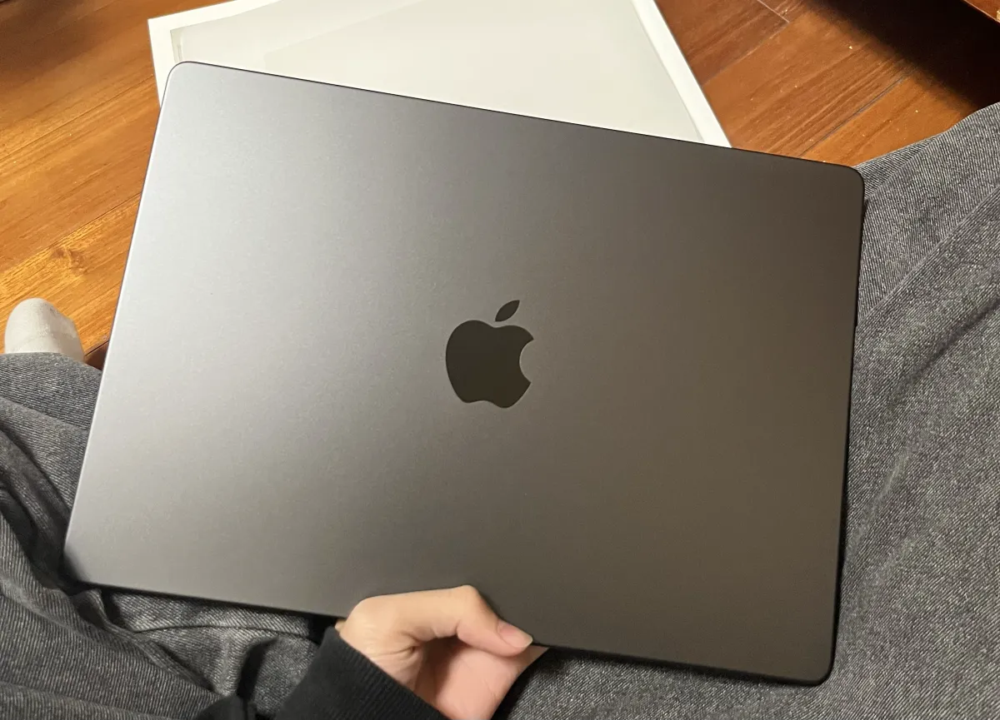
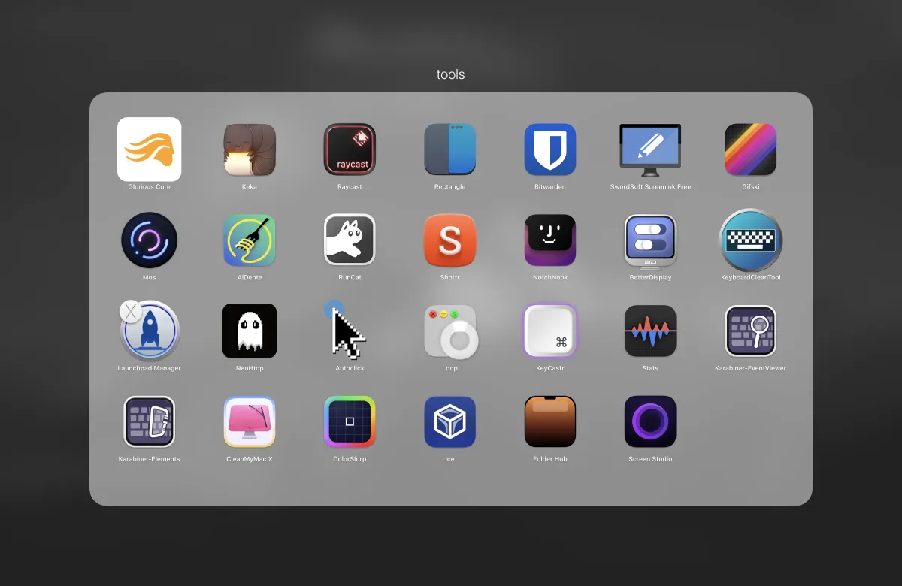
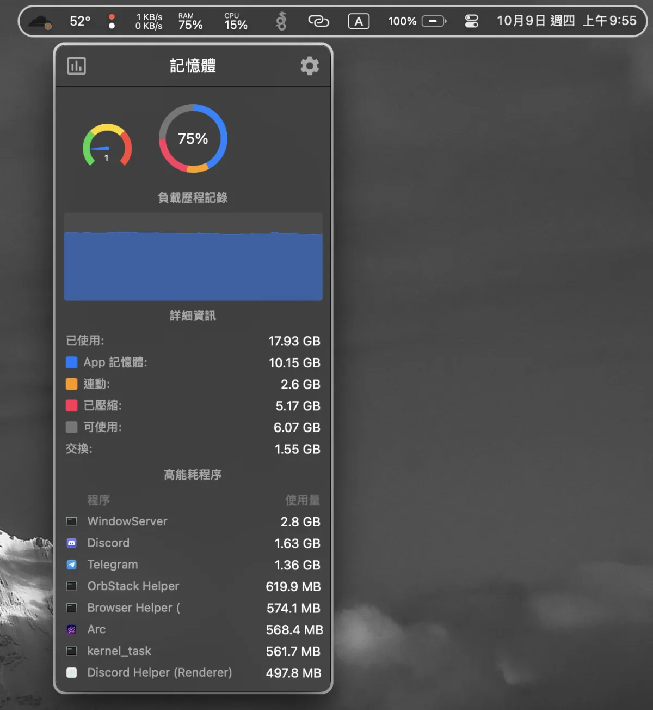
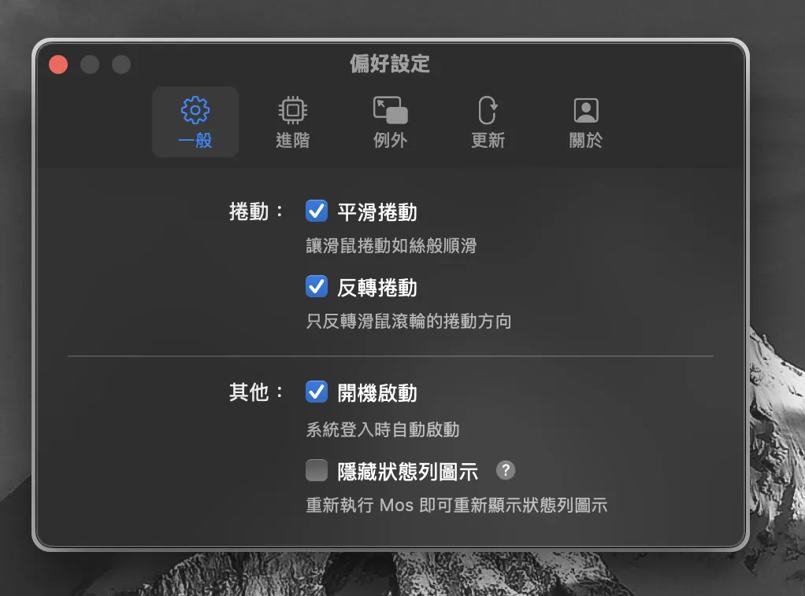
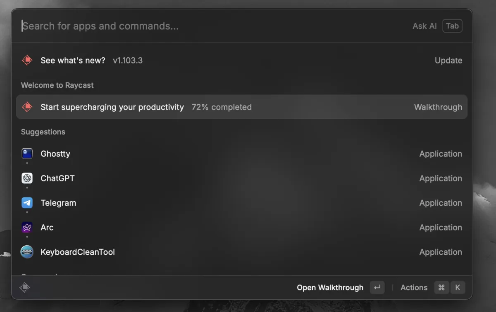
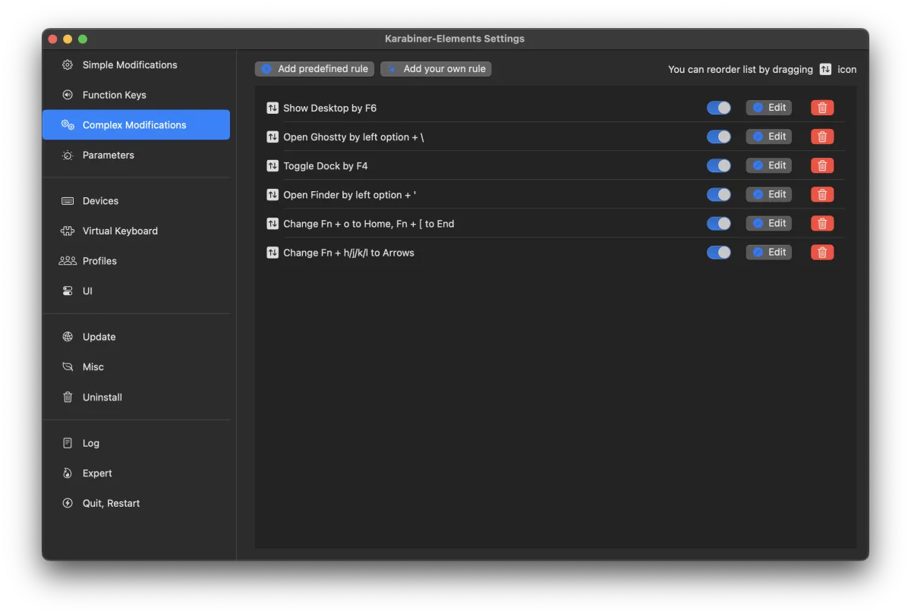
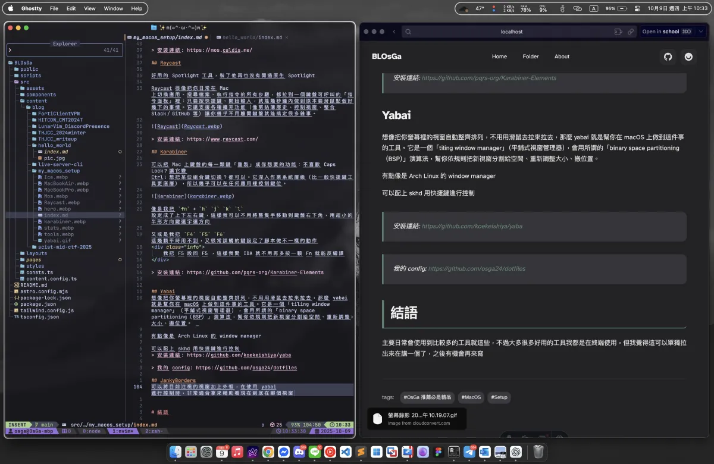

# 歷史
從小的夢想就是想擁有屬於自己的筆電，在國中獲得第一台 MacBook Air 2017 ，中間轉轉賣賣換換，到高中變成了 razer blade 15 ， 但是 Windows 的重量和一大坨的變壓器我的肩膀真的承受不住，於是因緣際會他轉生成了桌機 
只可惜開始接觸社群後，從龜在家裡的宅砲，變成會出門的宅砲，而且有時想再學校寫寫扣，只能用手機 ssh 回 homelab 開 Vim ，十分蛋疼，於是最終還是需要有一台筆電。

在最後的決定下入手了 MacBook Air M2 也就是跟著我到處跑的第一台筆電，但當初因為預算不多，加上有桌機可以 RDP ，所以買了最丐板的，想著應該也不常用，需要跑東西也可以 RDP 。

後面這台慢慢變成我的主力機，我發現需求越來越大，所以在 M4 一出的時候我立馬下單，升級成了 M4 MacBook Pro，而且一次就上頂一點，想著希望這台可以陪我奮鬥久一點

這台也順理成章成為了我的主力機，直接把我的桌機搬回高雄，出門在外全靠這台

---

講那麼多廢話要開始說工具沒 zz

# 推薦小工具

用 Mac 這麼久，設定真的複雜到很多，所以先從一些小工具開始吧

挑幾個主要現在在用的講

## Stats
開源的狀態監測工具，十分好用，可以顯示得資訊非常多，並且可以放在 menu bar 方便監測

> 安裝連結: https://github.com/exelban/stats

## Ice
開源版的 Bartender，自從 Bartender 默默賣給中國公司之後，就不太敢在使用，尤其 Bartender 偶爾就會開始監測螢幕內容，用到心裡還是會怕怕的

在某次機會 CX330 跟我推薦 Ice 這款工具，基本上 Bartender 有的 Ice 都有，而且又是開源的，更加安心

不過他現在偶爾會有一些小 Bug ，希望之後更新能把一些 Issue 修好

> 安裝連結: https://github.com/jordanbaird/Ice

## Mos 
這款是我從第一台 MacBook Air 就必裝的軟體，在  MacOS 觸控板的方向會跟滑鼠滾動方向產生一個不合理的存在

如果你要預設方式使用觸控板，你滑鼠滾動就會反向，你要習慣性的使用滑鼠，觸控板就會反向

我想這是因為 Magic Mouse 的設定關係，不過，透過 Mos 這個工具就可以解決問題

他可以將滑鼠和處空版互相反向，達成你想要的方向，而且在 Mac 上使用一般的滾輪滑鼠，在滾動時會有卡卡的感覺，他也會模擬平滑捲動，讓體驗像是觸控板一樣

> 安裝連結: https://mos.caldis.me/

## Raycast

好用的 Spotlight 工具，裝了他再也沒有開過原生 Spotlight

Raycast 很像把你日常在 Mac 上切換應用、搜尋檔案、執行指令的所有步驟，都拉到一個鍵盤可呼叫的「指令面板」裡：只要按快捷鍵、開始輸入，就能幾秒鐘內做到原本要滑鼠點個好幾下的事情。它還支援各種擴充功能（像剪貼簿歷史、控制視窗、整合 Slack／GitHub 等）讓你幾乎不用離開鍵盤就能搞定很多雜事。

> 安裝連結: https://www.raycast.com/

## Karabiner

可以把 Mac 上鍵盤的每一顆鍵「重製」成你想要的功能：不喜歡 Caps Lock？讓它變 Ctrl；想把某些組合鍵切換？都可以。它深入作業系統層級（比一般快捷鍵工具更底層），所以幾乎可以在任何應用裡控制鍵位。

像是我把 `fn` + `h` `j` `k` `l` 設定成了上下左右鍵，這樣我可以不用將整隻手移動到鍵盤右下角，用超小的半形方向鍵選字選方向

又或是我把 `F4` `F5` `F6` 這幾顆平時用不到，又很常誤觸的鍵設定了腳本做不一樣的動作

	我把 F5 設回 F5 ，這樣我開 IDA 就不用再多按一顆 Fn 就能反編譯

> 安裝連結: https://github.com/pqrs-org/Karabiner-Elements

## Yabai
想像把你螢幕裡的視窗自動整齊排列，不用用滑鼠去拉來拉去，那麼 yabai 就是幫你在 macOS 上做到這件事的工具。它是一個「tiling window manager」（平鋪式視窗管理器），會用所謂的「binary space partitioning（BSP）」演算法，幫你依規則把新視窗分割給空間、重新調整大小、搬位置。 

有點像是 Arch Linux 的 window manager

可以配上 skhd 用快捷鍵進行控制
> 安裝連結: https://github.com/koekeishiya/yaba

> 我的 config: https://github.com/osga24/dotfiles

## JankyBorders
可以將目前注視的視窗加上外恇，在使用 yabai 進行控制時，非常適合拿來輔助看現在到底在哪個視窗

> 安裝連結: https://github.com/FelixKratz/JankyBorders

# 開發環境
基本上就是 LazyVim + tmux，這部分想要先挖個坑之後再填，不然這篇會烙烙長

# 結語

主要日常會使用到比較多的工具就這些，不過大多很多好用的工具我都是在終端使用，但我覺得這可以單獨拉出來在講一個了，之後有機會再來寫

嘻嘻終於把這坑填完了，如果有一些好用的工具要交流，歡迎找我！！！

