# 前言

這次很榮幸，也不知道為什麼突然有機會能擔任 AIS3 的助教，同時也是我第三年擔任 AIS3 Junior 助教

在接近快一個多月的專題馬拉松後，向老大 [@Red](https://貓.tw/) 學習，來記錄一下這 7 + 5 的一些趣事

不過這一篇不會紀錄太多關於課程的事，會以我的角度分享一些有趣的事情

（是說我本來計劃想拍 vlog ，不過我一上高鐵就懶了，後面也就不了了之了ㄏㄏ，而且根本沒時間）

## AIS3

### about AIS3 2026

**AIS3（Advanced Information Security Summer School，新型態資安暑期課程）** 是由教育部推動的資安人才培育活動。

AIS3 涵蓋的範圍相當廣，不論你原本接觸的是 Web 開發，或是對於軟體工程、系統與網路有興趣，還是 PVP 大佬，還是 PVP 大佬，還是 PVP 大佬，還是 PVP 大佬，還是 PVP 大佬 ，都能從自己熟悉的領域找到與資訊安全交會的地方。透過課程、實作與專題研究，參與者可以從不同方向理解「安全」如何成為各種資訊技術中不可忽視的一環。

以往會在七天營隊黑客松專題，但今年主辦希望大家好好上課好好睡覺，所以改變規則

專題題目會由講師出題，並延長至活動後五 ~ 六天線上報告

而這次我與老大 [@Red](https://貓.tw) 和老朋友 [@dkri3c1](https://dkri3c1.github.io)，一起擔任 **跨領域安全** 的助教，著重在於工控或是無人機等相關領域

# Day 0

今年與往年不一樣，從公設與房間成反比的豪華 12 舍，改到根本沒公設的 7 舍（聽說是今年暑假營隊都集中給 7、8 舍）

礙於我是從高雄出發，距離非常遙遠，於是...

你以為我會 Day 0 就到嗎？~~那個宿舍能少睡一天是一天~~，因為當天有 F1 加上家裡還有事，所以我就決定隔天一早出發，誒嘿

不過當我已經有心理準備，未來一週要躺在木板睡覺時，突然被拉了 chat，居然是兩位先行的助教勇士，在討論要不要逃離七舍

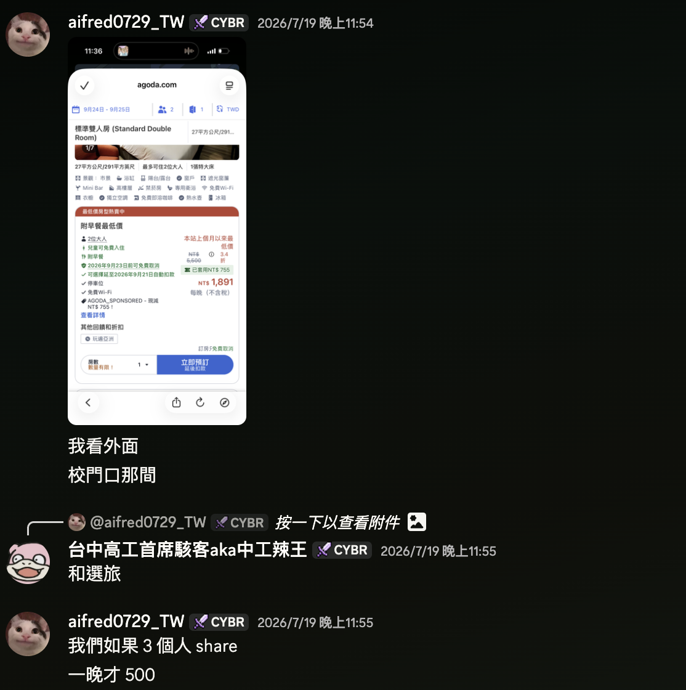

兩位勇士決定先睡一晚頻估一下，至於我覺得這是一個很划算的選擇，至少可以睡得舒服，也比較有動力可以協助學員，距離甚至也不遠！就當作投資吧

遺憾的是隔天飯店就沒空位了法克

# Day 1

當天搭了最早一班的高鐵和捷運出發，原本想請我家人直接載到高鐵站，但最後把我放在捷運站

但捷運第一班等了快十五分鐘才來，根本趕不上高鐵，15 分發車的高鐵 13 才出捷運，左營高鐵站設計又是要一直上上下下，我還扛著一個超大的行李箱，但幸好最後有趕上，高鐵真的會等人！！站務人員也很好心的引導，只是我上高鐵直接一個心悸大戰

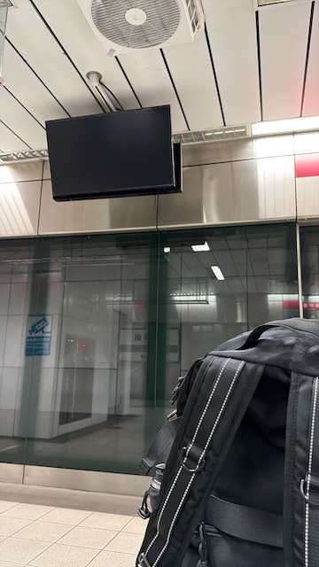

搭上高鐵後和 [@chao](https://chaontc.tw/) 在高鐵上面會合，暖男還幫我帶早餐，因為我根本沒時間可以在高鐵站買

到新竹後我們直接轉戰計程車站，結果大排長龍，我們越排越不對勁，等了快半個小時才有車，具體原因可以看[這篇文章](https://www.threads.com/share/Dzp8H9Z3Q/)

新竹高鐵出來搭計程車區

自然走到計程車區～
結果看了很多人在排隊，很多小黃卻無法進來，只有少少量Mx都會小黃的車可以進來～

上網查才知道，那邊被他們標到？！

只有內行人知道要去4號出口，六家車站搭，車比較多～

from: [supersunny_kaja's threads](https://www.threads.com/share/Dzp8H9Z3Q/)

反正等了半個多小時後終於搭上車了，結果悲劇還沒結束，因為剛好是上班時間，所以整個大塞車，原定可能 20 分鐘內的車程拉到了 40 多分鐘才到交大，直接壓線報到，後面看到討論區還有一堆學員還沒搭上車只能大遲到，可惜沒有一起拼車

報到完拿到 badge 綁上我的狗狗，第一天的課程就開始了！

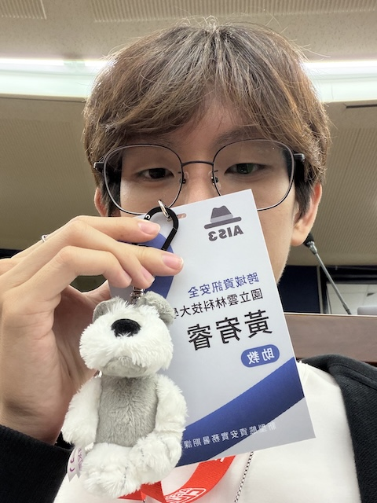

晚上想說趁第一天，加上專題題目也還沒公布，所以確認完都沒什麼問題我們飄去清大夜市找[清大蠹魚](https://solarfish.me/about/)一起吃冰，不過誰都沒想到，這一晚會變成奶娃蠕蟲散發的第一天...

在吃冰的時候和 [@Red](https://貓.tw) 交換了很多虧賊照片，直到嚴肅奶娃的出現，事情都變得不一樣了...

助教三人之一的 OsGa 提出：我們來把 Discord 頭貼換這個吧！嚴肅一點

於是...

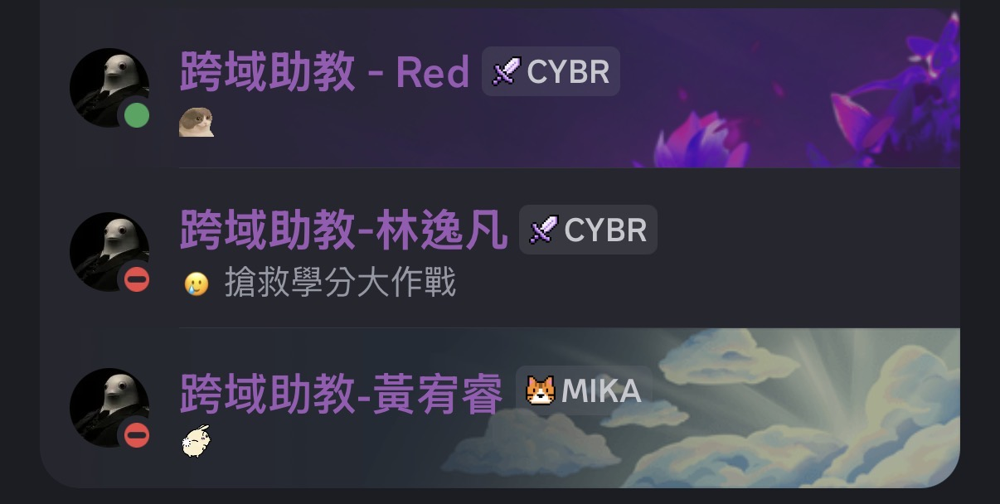

本來以為只是有趣的小彩蛋，看有沒有學員發現，結果後面整個 AIS3 ，甚至到 Junior 全部都是 #嚴肅、#奶龍、#嚴肅奶龍，甚至連助理的頭貼，還有破冰活動都有嚴肅奶龍的出現...

如果你沒來參加 AIS3 和 Junior ，懷疑暑假怎麼那麼多資安圈的人在雙手抱胸一直喊嚴肅嚴肅，或是 Discord 頭貼變奶龍，我很抱歉...

# Day 2

開啟美好的一天，從七舍的床起來，其實沒有想像中的糟，個人覺得衛浴比十二舍還要方便

前一天晚上和 [@Red](https://貓.tw) 聊一聊拿到了助教 & STAFF 才有的歌單，一早點了崴孟三百天給大家一個幸福早晨

喔對，AIS3 的助教不用像 Jr 一樣要自己處理，助理會幫忙訂好，午餐吃一個超爽超肥的馬鈴薯泥炸雞

買尬！！主食是馬鈴薯泥誒，我到現在都還念念不忘

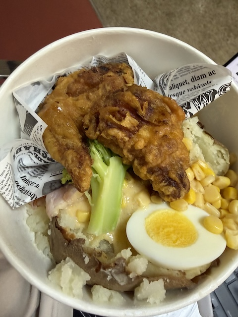

早上課程結束後就是 Mico 的分享，每次聽完前輩們的分享都會重新燃起在這條道路的熱血

此時突然出現一個講師，哎呀這不是晚上通識課講師**海狗007**嗎，怎麼還在做簡報，好像似曾相識的畫面（Ｘ

因為 Agent 的崛起，這七天的簡報樣式有各種，PPT、Canva 甚至網頁

不過這堂課的簡報我堪稱最強 **「kahoot」** ，不過內容太多時間太少回答題目根本跟不上，還被 🍊 譴責

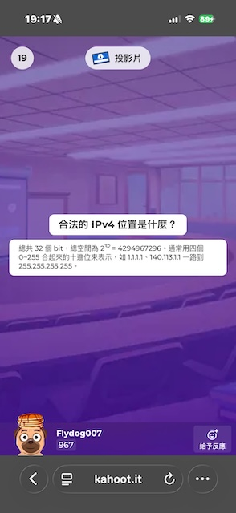

下課後的宿舍出現了一個小插曲，有學員把自己反鎖在外面，宿服大哥說要助教去協助借，就發生今年迷因之一： **「你台大怎麼混到交大來」**

# Day3

晚上橘子分享講故事講三小時意猶未盡，結束後簽名大排長龍到被趕出去

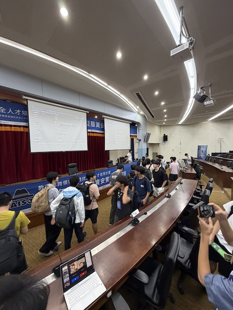

晚上 [@1ping](https://1ping.org/) 開車車載我們出去兜風，本來要去吃海底撈結果這裡也大排長龍所以去吃了生蠔和炒麵，潮爽

然後七舍的床完全放不下我的腳。只能蜷縮起來

# Day4

紀錄到後面越寫越懶

- 校友分享
  - 爽吃 subway
  - 配飛龍燦金之旅脫口秀
    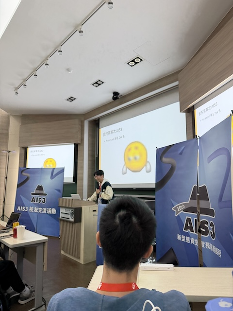

# Day5

抽主題！上台嚴肅說明

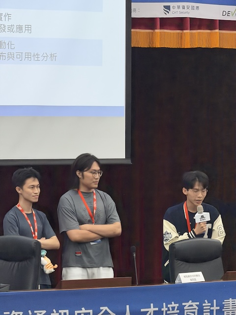

晚上宿舍發生一些事情，有些房間被進去刷油漆，有提前公告但在我們注意不到的地方，大家都沒收到通知 TT，有人的東西被亂動，被摔壞，鎖一個心酸的門

礙於宿舍只有助教沒有 STAFF ，所以去幫忙協助處理，不過感謝後面 STAFF 學長們的協助，被摔壞物品的同學有得到賠償，可喜可賀辛苦大家 🙏

# Day6

專題專題專題，大家都很努力在做專題

晚上 Chummy 爸爸請吃晚餐，謝謝爸爸

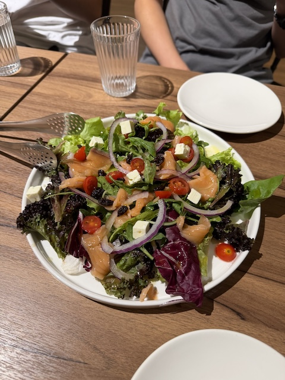

最後一晚睡七舍，眾所皆知 [@Red](https://貓.tw) 是一個專業級生存遊戲玩家，平時帶個夜視鏡跟超強手電筒出門應該都挺正常的

晚上睡覺前我們關燈開手電筒，發現塵塵蟎灰塵滿天飛，這幾天一直大過敏

結束回去後皮膚變黃黃的，眼睛綠綠的，手指發黑...

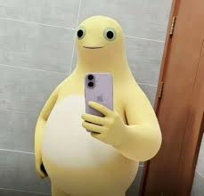

# Day7

掰掰七舍，掰掰最後ㄉ實體討論！

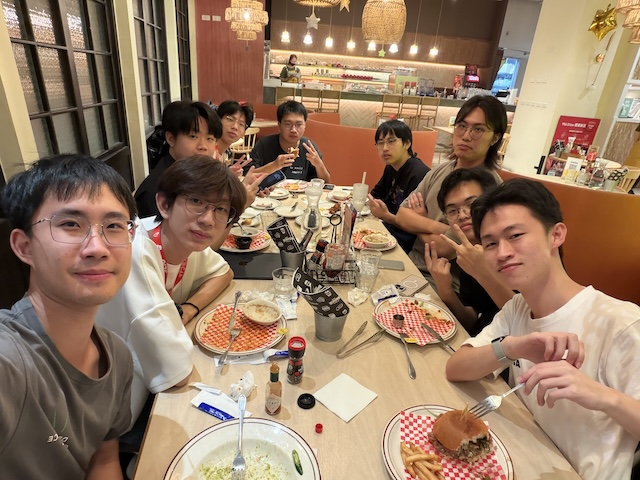

# 收個尾

看得出來後面的紀錄越來越敷衍，因為這篇被我拖很久又想要趕快分享給大家，如果有想到好像的再來補

因為 AIS3 其實全程禁止拍照錄影等等，所以這篇文章就紀錄一些有趣的事情，也是我第一次用不一樣的角度參加 AIS3，沒有想過這個機會來得那麼快

是說 AIS3 結束後過兩週就是 Junior 在清大，教育體系也在交大，暑假兩個月有一個月都在新竹了（

本來還想說順便寫 Junior 的部分但篇幅會變很長，有機會再補吧 =w=

在當助教之前看了好幾遍 [@Red](https://貓.tw) 的文章，自己下來體驗之後真的是一個不一樣的視角，掛著 STAFF 的學員

七天課程也學到很多，認識了很多新朋友，希望之後還有機會可以來協助大家 ><

原諒我這篇文章比較沒有跟課程、專題相關的分享w，不過有興趣的話歡迎來找我聊聊 `(⌒ω⌒)ﾉ`
